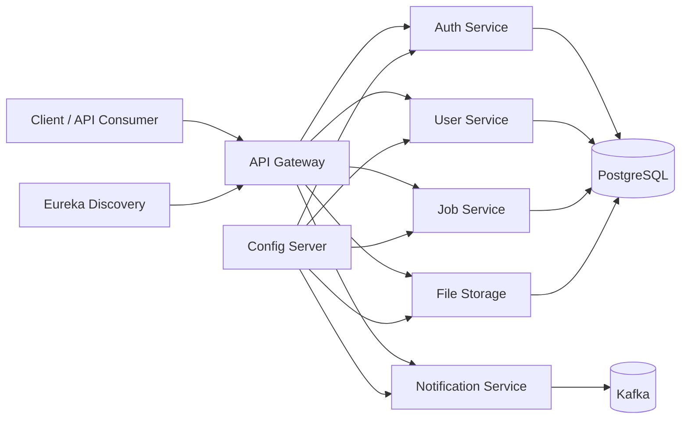

# Spring Boot Microservices Reference Platform

This repository is a Spring Boot microservices reference platform that is being evolved toward production readiness.

## Portfolio Value

MicroMart demonstrates backend system design across a realistic microservices platform: gateway routing, discovery, centralized configuration, authentication, service-owned schemas, Kafka-based messaging, file storage, CI validation, Docker packaging, health checks, and production-readiness planning.



## Skills Demonstrated

- Spring Boot 3 and Spring Cloud service composition.
- API gateway, service discovery, and centralized configuration.
- PostgreSQL schema ownership with Flyway migrations.
- Kafka-backed notification workflows.
- Docker Compose local platform orchestration.
- CI checks, actuator health endpoints, and production readiness gates.

## Author

Feng Yang

It is not currently ready for mass-user production traffic. The documentation in `docs/` defines the target architecture, build principles, production readiness gates, and roadmap required to get there.

## Services

| Service | Purpose |
| --- | --- |
| `config-server` | Centralized Spring Cloud configuration. |
| `eureka-server` | Service discovery. |
| `gateway` | API Gateway and external routing. |
| `auth-service` | Registration, login, and token issuing. |
| `user-service` | User and profile management. |
| `job-service` | Example domain service for categories, jobs, adverts, and offers. |
| `notification-service` | Notification API and Kafka consumer. |
| `file-storage` | File metadata and binary storage API. |

## Current Infrastructure

The current `docker-compose.yml` starts the full local platform:

- PostgreSQL
- Zookeeper
- Kafka
- Kafka UI
- Config Server
- Eureka Server
- Gateway
- Auth Service
- User Service
- Job Service
- Notification Service
- File Storage

Gateway is exposed on `http://localhost:8080`. Eureka and Kafka UI are exposed for local diagnostics only.

## Production Foundation Status

The first real-project foundation milestone has started:

- Services are upgraded to Spring Boot `3.5.16` and Spring Cloud `2025.0.3`.
- Java source is migrated to Jakarta APIs for Boot 3 compatibility.
- Spring Security configuration uses Spring Security 6 APIs.
- Config Server, Eureka, PostgreSQL, Kafka, JWT, CORS, file storage, and admin bootstrap settings are environment-driven.
- `.env.example` documents required local and VPS variables.
- JWT secrets and the default admin password hash are no longer hardcoded in source.
- All eight services have multi-stage Dockerfiles.
- Docker Compose builds and runs the full local platform with stable internal service ports.
- Persistence-owning services use Flyway migrations with service-owned PostgreSQL schemas.
- Hibernate schema management defaults to `validate` instead of `update`.
- All services expose Spring Boot Actuator health/readiness endpoints.
- Docker Compose healthchecks use actuator health endpoints for Spring services.
- GitHub Actions CI builds and tests all eight Maven services and validates Docker Compose.
- Health smoke-test scripts are available for local composed environments.

The project still needs deeper integration/load tests, backup/restore automation, alerting, tracing, and readiness validation before production use.

## Documentation

Start here:

- [Documentation Index](docs/README.md)
- [Vision and Scope](docs/01-vision-and-scope.md)
- [Current State Assessment](docs/02-current-state-assessment.md)
- [Target Architecture](docs/03-target-architecture.md)
- [Roadmap](docs/04-roadmap.md)
- [Build Principles](docs/05-build-principles.md)
- [Production Readiness](docs/06-production-readiness.md)

Operational topics:

- [VPS Docker Compose Deployment](docs/07-vps-docker-compose-deployment.md)
- [Security Hardening](docs/08-security-hardening.md)
- [Data and Migrations](docs/09-data-and-migrations.md)
- [Observability and Operations](docs/10-observability-and-operations.md)
- [Testing Strategy](docs/11-testing-strategy.md)
- [CI/CD](docs/12-ci-cd.md)

Decision records:

- [ADR 0001: Initial Deployment Target](docs/adr/0001-deployment-target.md)

## Docker Compose Startup

1. Create a local environment file:

```bash
cp .env.example .env
```

2. Review `.env`, especially `POSTGRES_PASSWORD`, `JWT_SECRET`, and exposed host ports.

3. Build and start the platform:

```bash
docker compose up --build
```

4. Access the gateway:

```text
http://localhost:8080
```

Local diagnostics:

```text
Eureka: http://localhost:8761
Kafka UI: http://localhost:9090
Gateway health: http://localhost:8080/actuator/health
Gateway readiness: http://localhost:8080/actuator/health/readiness
```

For production or public VPS use, expose only the reverse proxy or gateway. Do not expose PostgreSQL, Kafka, Zookeeper, Config Server, Eureka, or Kafka UI publicly.

## Host Java Verification

Docker builds use a containerized Maven/JDK image and do not require host `JAVA_HOME`.

Running Maven directly on the host still requires a JDK 17+ installation and `JAVA_HOME` pointing to that JDK:

```bash
java -version
echo $JAVA_HOME
```

On Windows PowerShell:

```powershell
java -version
$env:JAVA_HOME
```

## Verification

GitHub Actions runs the baseline CI workflow on push and pull requests:

- Maven tests for all eight services.
- Docker Compose configuration validation.
- Docker image build checks.

Run a local service test from any service directory:

```bash
SPRING_PROFILES_ACTIVE=test ./mvnw test
```

After starting the Compose platform, run smoke checks:

```bash
./scripts/smoke/health-check.sh
```

On Windows PowerShell:

```powershell
.\scripts\smoke\health-check.ps1
```

## Production Readiness

Before real users, the project must satisfy the gates in [Production Readiness](docs/06-production-readiness.md):

- Security.
- Reliability.
- Data protection.
- Observability.
- Performance and scale.
- Release and rollback.
- Operations.

Documentation is the first step. Implementation, testing, deployment automation, monitoring, backup/restore, and load validation are still required.

## Next Build Direction

Follow the roadmap in [Roadmap](docs/04-roadmap.md):

1. Harden authorization, file upload, and operational endpoint security.
2. Add metrics stack, tracing, alerts, and runbooks.
3. Add deeper integration, contract, security, and load tests.
4. Add backup/restore automation.
5. Add deployment automation and image publishing.
6. Prove readiness through release gates.
