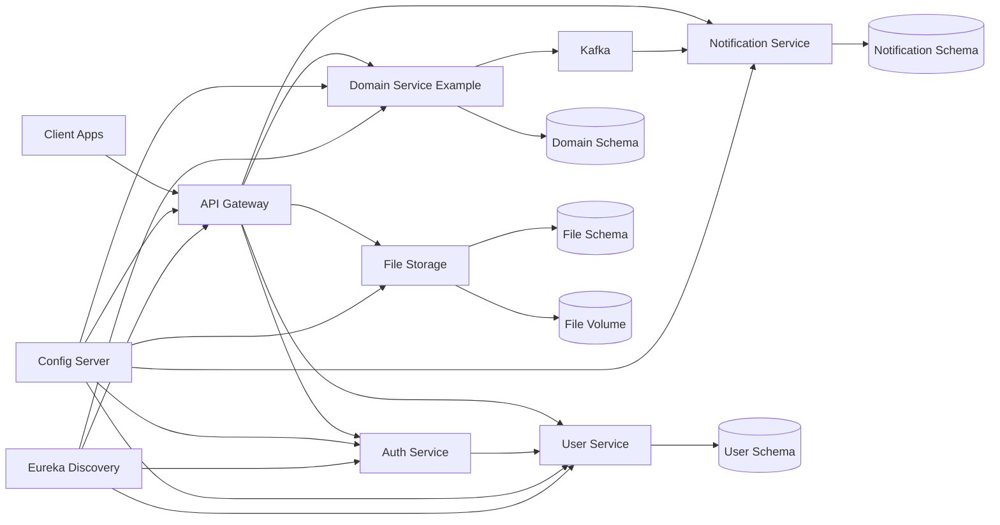

# Target Architecture

## Architecture Goals

- Keep services independently buildable and deployable.
- Route all external API traffic through the gateway.
- Keep service configuration environment-driven.
- Make each service own its data model and migrations.
- Prefer asynchronous communication for events and side effects.
- Make failures observable, recoverable, and testable.

## Logical View

## Service Responsibilities

### Gateway

- Own external routing.
- Validate externally supplied access tokens.
- Apply request limits, CORS policy, and public/private route separation.
- Expose only safe operational endpoints.

### Auth Service

- Own authentication workflows.
- Issue tokens using environment-provided signing material.
- Avoid owning user profile data directly.
- Delegate user lookup and registration persistence to `user-service` until a dedicated identity model is introduced.

### User Service

- Own user profile and account records.
- Own user-related migrations.
- Enforce account-level authorization rules.

### Domain Service Example

The current `job-service` should be treated as an example business/domain service. It shows:

- CRUD for domain entities.
- Synchronous service calls through Feign.
- Domain events through Kafka.
- Authorization checks tied to domain ownership.

### Notification Service

- Own notification records and delivery state.
- Consume notification events from Kafka.
- Use retry and dead-letter policies for failed messages.

### File Storage

- Own file metadata.
- Store binaries in a configured persistent storage location.
- Keep upload limits, content-type validation, malware scanning strategy, and retention policy documented.

## Communication Rules

- External clients call only the gateway.
- Services use synchronous calls only for data required immediately to complete the request.
- Services publish events for side effects such as notifications.
- Events must have names, schemas, owners, retry policy, and versioning rules.
- Cross-service calls must have timeouts, retry limits, and fallback behavior.

## Data Ownership

The preferred first step is schema-per-service within the same PostgreSQL instance. This is practical for Docker Compose and still creates ownership boundaries.

Later, the platform can move to database-per-service when operational maturity increases.

Rules:

- No service should write another service's schema.
- Migrations belong to the service that owns the schema.
- Shared lookup tables should be avoided unless they have a clear owner.
- Cross-service reads should go through APIs or events, not direct database joins.

## Deployment View

For the first real deployment target, run on one VPS with:

- One Docker network for internal services.
- Only the reverse proxy and gateway exposed publicly.
- PostgreSQL, Kafka, Zookeeper, Config Server, Eureka, and service ports kept private.
- Named volumes for database, Kafka, and file storage.
- Healthchecks and restart policies for every container.
- A reverse proxy such as Nginx, Caddy, or Traefik for TLS termination.

## Future Kubernetes View

Kubernetes should be considered after the Compose deployment is stable and operational needs justify it. The move should replace:

- Compose services with Deployments or StatefulSets.
- `.env` files with ConfigMaps and Secrets.
- Reverse proxy with Ingress.
- Named volumes with PersistentVolumeClaims or managed storage.
- Manual VPS deployment with cluster-aware rollout and rollback.
