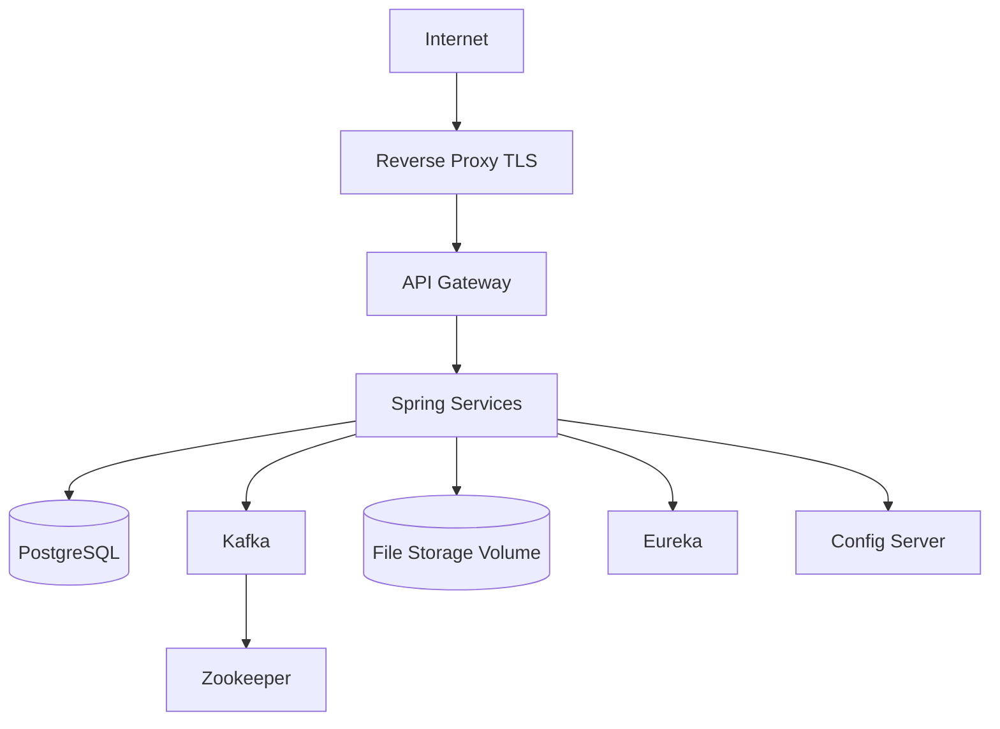

# VPS Docker Compose Deployment

This document describes the first production-style deployment target: Docker Compose on a single VPS.

This target is suitable for learning, staging, internal trials, and limited early production. It is not enough for mass-user scale unless capacity, monitoring, backup, security, and rollback gates are satisfied.

## Target Topology



## Required Compose Changes

The current Compose file now starts the full local platform:

- PostgreSQL, Zookeeper, Kafka, and Kafka UI.
- Config Server and Eureka Server.
- Gateway, auth, user, job, notification, and file-storage services.
- One internal Docker network.
- Named volumes for PostgreSQL, Kafka, Zookeeper, and file uploads.
- Restart policies and practical healthchecks.
- Environment variable configuration through `.env`.

For public VPS deployment, keep only the reverse proxy or gateway public. Local diagnostic ports such as Eureka and Kafka UI should not be exposed publicly.

## Service Images

Each Spring Boot service has a Dockerfile that:

- Builds from a pinned JDK/Maven image or uses a CI-built jar.
- Runs on a pinned JRE image.
- Uses a non-root user.
- Exposes the service port.
- Defines JVM memory behavior appropriate for containers.
- Does not bake secrets into the image.

Image names should include the commit SHA or release version.

Example naming pattern:

```text
registry.example.com/microservices/gateway:1.0.0
registry.example.com/microservices/user-service:1.0.0
```

Current local image names:

```text
spring-boot-microservices/config-server:local
spring-boot-microservices/eureka-server:local
spring-boot-microservices/gateway:local
spring-boot-microservices/auth-service:local
spring-boot-microservices/user-service:local
spring-boot-microservices/job-service:local
spring-boot-microservices/notification-service:local
spring-boot-microservices/file-storage:local
```

## Environment Files

Copy `.env.example` to `.env` for local Compose. Real `.env` files must not be committed.

Expected variable groups:

- PostgreSQL database, user, password, host, and port.
- Kafka bootstrap servers.
- Eureka URL.
- Config Server URL.
- JWT secret or key location.
- File storage path.
- Active Spring profile.
- Reverse proxy domain.

Compose uses service-name values by default:

```text
SPRING_DATASOURCE_URL=jdbc:postgresql://postgres:5432/microservice
CONFIG_SERVER_URI=http://config-server:8888
EUREKA_URI=http://eureka-server:8761/eureka
KAFKA_BOOTSTRAP_SERVERS=kafka:9093
FILE_STORAGE_PATH=/data/uploads
```

Manual host-based runs should use `localhost` values instead.

## Service Ports

| Service | Container Port | Local Host Port |
| --- | ---: | ---: |
| `gateway` | `8080` | `8080` |
| `config-server` | `8888` | `8888` |
| `eureka-server` | `8761` | `8761` |
| `auth-service` | `8081` | internal only |
| `user-service` | `8082` | internal only |
| `job-service` | `8083` | internal only |
| `notification-service` | `8084` | internal only |
| `file-storage` | `8085` | internal only |
| `kafka-ui` | `8080` | `9090` |
| `postgres` | `5432` | `5432` local only |
| `kafka` | `9092` / `9093` | `9092` local only |

## Startup Order

Recommended order:

1. PostgreSQL.
2. Zookeeper and Kafka.
3. Config Server.
4. Eureka Server.
5. Gateway.
6. Auth, user, domain, notification, and file services.
7. Reverse proxy.

Startup order does not replace healthchecks. Services must handle dependencies being temporarily unavailable.

## Healthchecks

Spring service containers use Actuator health endpoints for Docker healthchecks:

```text
/actuator/health
/actuator/health/readiness
```

Use these commands during local operations:

```bash
docker compose ps
docker compose logs -f gateway
```

Gateway health is available at:

```text
http://localhost:8080/actuator/health
http://localhost:8080/actuator/health/readiness
```

## Public Exposure

Only expose:

- Port `80` and `443` on the reverse proxy.
- Optionally port `8080` for gateway in local development only.

Do not expose:

- PostgreSQL.
- Kafka.
- Zookeeper.
- Config Server.
- Eureka.
- Actuator endpoints.
- Kafka UI in production unless protected by authentication and network restrictions.

## TLS and Reverse Proxy

Use a reverse proxy such as Caddy, Nginx, or Traefik.

Responsibilities:

- TLS termination.
- HTTP to HTTPS redirect.
- Request size limits.
- Rate limits.
- Security headers.
- Proxy to gateway only.

## Volumes

Required durable volumes:

- PostgreSQL data.
- Kafka data.
- Zookeeper data.
- File storage uploads.

Current named volumes:

```text
postgres_data
zookeeper_data
kafka_data
file_storage_data
```

Volume backup and restore must be documented and tested.

## Deployment Procedure

Minimum procedure:

1. Copy `.env.example` to `.env`.
2. Set real values for `POSTGRES_PASSWORD`, `JWT_SECRET`, and exposed host ports.
3. Build and start the platform:

```bash
docker compose up --build
```

4. Check service status:

```bash
docker compose ps
```

5. Check logs for a service:

```bash
docker compose logs -f gateway
```

6. Run smoke tests through the gateway.
7. Check health, logs, database, Kafka, and disk usage.
8. Record deployed versions.

For host Maven verification outside Docker, install JDK 17+ and set `JAVA_HOME`. Docker builds use containerized Maven/JDK and do not require host `JAVA_HOME`.

## Rollback Procedure

Minimum rollback path:

1. Identify the previous known-good image versions.
2. Confirm whether migrations are backward compatible.
3. Deploy previous images.
4. Run smoke tests.
5. Monitor errors, latency, database, and Kafka lag.
6. Restore database only if rollback cannot work safely with existing data.

## Backup and Restore

Backups should include:

- PostgreSQL dump or volume snapshot.
- File storage volume.
- Deployment `.env` backup stored securely.
- Compose file and image version record.

Restore must be tested before production launch.
