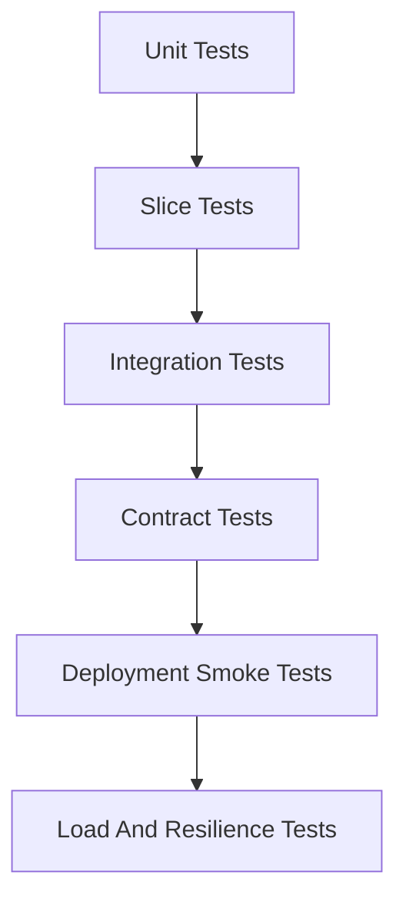

# Testing Strategy

The current project mostly has generated startup tests. A production-ready reference platform needs tests that cover behavior, integration points, security, and deployment confidence.

## Test Pyramid

## Unit Tests

Use for:

- Domain rules.
- DTO mapping.
- Validation helpers.
- Authorization helper methods.
- Error handling decisions.

Unit tests should be fast and not require Spring context unless necessary.

## Slice Tests

Use Spring slice tests for:

- Controllers.
- Validation.
- Security filters.
- Repository behavior.
- JSON serialization.

Examples:

- `@WebMvcTest` for servlet controllers.
- `@DataJpaTest` for JPA repositories.
- Gateway-specific tests for routes and filters.

## Integration Tests

Use Testcontainers for dependencies:

- PostgreSQL.
- Kafka.
- Optional object storage emulator if file storage evolves.

Integration tests should cover:

- Service startup with realistic config.
- Repository and migration behavior.
- Kafka producer and consumer behavior.
- Feign client behavior with mocked or containerized dependencies.
- File upload and download behavior with a temporary storage path.

## Contract Tests

Contract tests protect service boundaries.

Recommended contracts:

- Gateway to downstream REST APIs.
- Auth service to user service.
- Job/domain service to user and file services.
- Kafka notification event schema.

Contracts should define request, response, status codes, required fields, and event schema versions.

## Security Tests

Every protected endpoint should have tests for:

- No token.
- Invalid token.
- Wrong role.
- Resource owner.
- Admin role.
- Cross-user access denial.

Gateway token validation and downstream authorization must both be tested.

## Smoke Tests

Smoke tests run after deployment and verify critical flows through the gateway.

Implemented baseline:

- `scripts/smoke/health-check.sh`
- `scripts/smoke/health-check.ps1`

These scripts currently check gateway health and readiness endpoints.

Minimum flows:

- Gateway health.
- Register or bootstrap test user in non-production.
- Login.
- Authenticated user lookup.
- Create example domain record.
- Publish and consume notification event.
- Upload and download file.

Production smoke tests should avoid creating uncontrolled real user data.

## Load Tests

Load tests are required before claiming mass-user readiness.

Define:

- Target requests per second.
- User journey mix.
- Test duration.
- Acceptable P95 and P99 latency.
- Acceptable error rate.
- Database and Kafka limits.

Track during load:

- Gateway latency.
- Service latency.
- JVM memory and garbage collection.
- Database connections.
- Kafka lag.
- CPU and memory per container.
- Disk usage.

## Test Data

Use separate data for:

- Unit tests.
- Integration tests.
- Local manual testing.
- Staging smoke tests.
- Production smoke tests.

Tests must not depend on a hardcoded sample admin user.

## Minimum Next Step

Implemented baseline CI milestone:

- GitHub Actions runs Maven tests for all eight services.
- Tests use a `test` profile to avoid accidental dependency on live Config Server, Eureka, PostgreSQL, Kafka, or production secrets.
- Docker Compose config and build checks run in CI.
- Gateway health smoke-test scripts exist for local composed environments.

Next testing milestones:

- Replace empty `contextLoads()` checks with meaningful startup assertions.
- Add controller/security tests for auth, user, and gateway.
- Add PostgreSQL Testcontainers tests for persistence and Flyway migrations.
- Add Kafka Testcontainers tests for notification flow.
- Add contract tests for REST and Kafka boundaries.
