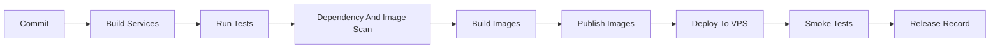

# CI/CD

CI/CD should make every release repeatable, traceable, and safe to roll back.

## Pipeline Goals

- Build every service.
- Run tests automatically.
- Enforce security and quality gates.
- Build versioned Docker images.
- Publish images to a registry.
- Deploy to VPS using a controlled workflow.
- Run smoke tests after deployment.

Implemented baseline:

- `.github/workflows/ci.yml` runs Maven tests for all eight services.
- CI validates Docker Compose configuration.
- CI builds Docker images through Compose.
- Test profile defaults avoid accidental dependency on production infrastructure.

## Suggested Pipeline Stages

## Build Stage

For each service:

- Validate Maven wrapper.
- Compile.
- Run unit and slice tests.
- Generate build artifact.

Because the repository has independent Maven projects, the CI workflow should explicitly build each service or introduce a root aggregator later.

## Test Stage

Required checks:

- Unit tests.
- Controller and validation tests.
- Security tests.
- Repository tests.
- Kafka integration tests.
- Gateway route/filter tests.
- Migration tests.

Use Testcontainers for PostgreSQL and Kafka integration tests.

## Security Stage

Required checks:

- Dependency vulnerability scan.
- Container image vulnerability scan.
- Secret scan.
- License policy check if needed.

The pipeline should fail when high-risk issues are found unless an approved exception exists.

## Image Stage

Each service image should be tagged with:

- Release version.
- Git commit SHA.
- Optional branch tag for non-production environments.

Avoid `latest` for deployments.

## Deployment Stage

For VPS deployment:

- Pull versioned images.
- Apply configuration from server-managed `.env`.
- Run migrations.
- Update Compose services.
- Run smoke tests.
- Record deployed image versions.

Deployment should require manual approval for production until confidence is built.

## Rollback Stage

Rollback should be possible by redeploying previous image versions.

Before every release, confirm:

- Previous image versions are still available.
- Migrations are backward compatible or have a recovery procedure.
- Smoke tests exist for critical flows.

## Branch and Release Policy

Suggested policy:

- Pull requests run build, test, and scan checks.
- Main branch must stay deployable.
- Releases use semantic versions or date-based versions.
- Production deployments are tagged.
- Hotfixes follow the same checks unless there is an emergency exception.

## Minimum First CI Workflow

Implemented:

- Build all Maven services.
- Run tests.
- Build Docker images.
- Validate Docker Compose configuration.

Still to add:

- Secret scanning.
- Dependency and image vulnerability scans.
- Image publishing for non-production use.
- Deployment automation.
- Post-deployment smoke tests in CI/CD environments.
